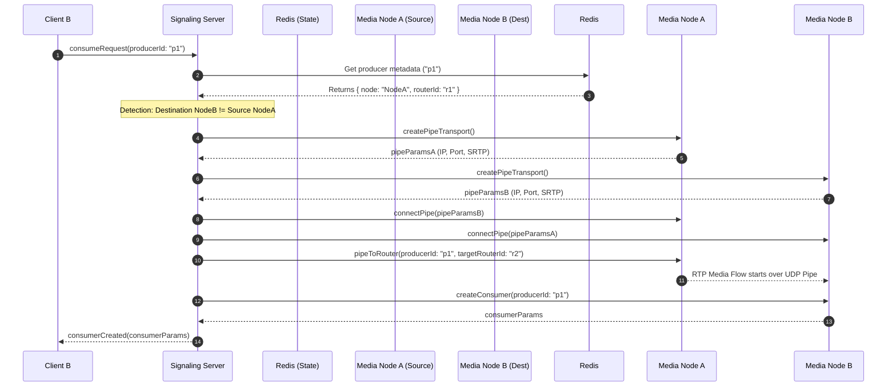
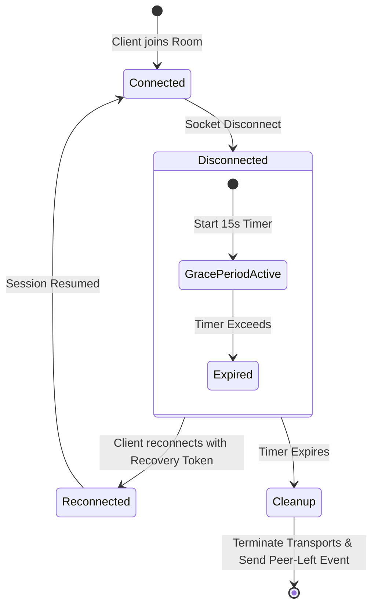

# MediaSoup Streaming System: Comprehensive Architectural Analysis

This document provides a production-grade architectural blueprint for scaling, securing, and recording our MediaSoup-based live streaming platform. It establishes the concrete patterns, data models, and system protocols required to support high-throughput, low-latency video streaming.

---

## 1. MediaSoup Scaling: Multi-Node Routing with PipeTransports

In a standard MediaSoup deployment, a single worker process is single-threaded and bound to a single CPU core. While running one worker per core scales room capacities up to the limits of a single host, large-scale events or high concurrent room volumes necessitate multi-node scaling.

### 1.1 Multi-Node Routing Topology (Cascading)
To scale a room across multiple media nodes, we establish a **Cascading Mesh Topology** using MediaSoup's `PipeTransport` APIs. Instead of direct client-to-client connections, media workers pipe streams to each other.

```
                  ┌─────────────────┐
                  │ Signaling Node  │ (Socket.IO Cluster)
                  └─┬─────────────┬─┘
                    │             │
        (Pub/Sub)   │             │   (Pub/Sub)
                    ▼             ▼
             ┌───────────┐   ┌───────────┐
             │  Media 1  │   │  Media 2  │ (MediaSoup Workers)
             │ (Router 1)│   │ (Router 2)│
             └─────┬─────┘   └─────┬─────┘
                   │               │
                   └─[PipeTransport]─┘
                           ▲
             (Inter-Worker UDP RTP Piping)
```

### 1.2 Coordination Flow
When a client starts producing on Node A, and another client on Node B wants to consume that stream:

1. **Producer Registry Query**: The client on Node B requests to consume `producer_123`. The signaling server checks the room state and detects that `producer_123` resides on Node A, while the consumer is connected to Node B.
2. **Pipe Transport Initiation**:
   - The signaling server commands Node A (Router A) to create a `PipeTransport`.
   - The signaling server commands Node B (Router B) to create a `PipeTransport`.
3. **Transport Pairing**:
   - The signaling server connects the two `PipeTransports` by exchanging their local IP addresses, ports, and SRTP cryptographic parameters.
4. **Producer Piping**:
   - The signaling server calls `pipeToRouter` on Router A:
     ```typescript
     await pipeTransportA.consume({ producerId: "producer_123" });
     ```
   - This creates an internal `PipeConsumer` on Router A and an internal `PipeProducer` on Router B.
5. **Local Consumption**: The consumer on Node B can now consume the local `PipeProducer` on Router B, completely transparently.



### 1.3 Redis as State Store and Distributed Lock Registry
Redis acts as the single source of truth for the signaling cluster:

* **Room-to-Node Mapping**: A Redis Hash `room:node:<roomId>` stores which media node is handling which room.
* **Producer Mapping**: A Redis Hash `room:producers:<roomId>` maps `producerId` to `{ nodeUrl, routerId, kind, rtpParameters }`.
* **Lock Registry (Redlock)**: When establishing a pipe between Node A and Node B, concurrent connection requests from different users could trigger multiple duplicate `PipeTransport` creation calls. We use a distributed lock in Redis:
  ```
  Lock Key: lock:pipe:room_123:nodeA:nodeB
  ```
  The first signaling instance to acquire the lock creates the `PipeTransport` pair, saves the transport IDs in Redis, and subsequent concurrent requests reuse the existing pipe.

---

## 2. NAT Traversal (STUN/TURN) in Production

Production WebRTC streaming fails for roughly 15-20% of users behind symmetric NATs or restrictive corporate firewalls without a robust TURN relay server.

```
┌──────────┐            Direct UDP WebRTC (Blocked)            ┌────────────┐
│ Client A ├─────────────X─────────────────────────────────────X┤ Media Node │
└────┬─────┘                                                   └─────┬──────┘
     │                                                               │
     │             Relayed WebRTC via Coturn (UDP/TCP/TLS)            │
     └─────────────► [ STUN/TURN Server (Coturn) ] ──────────────────┘
```

### 2.1 Coturn Deployment & Routing Strategy
We run Coturn instances near our media workers (matching region/availability zones) to minimize latency.

* **DNS Round-Robin vs. Smart API Brokerage**:
  - DNS-based round-robin provides simple load balancing but fails to adapt to geo-proximity or server failures.
  - **Recommended Approach**: The signaling/API server acts as a **TURN Credential Broker**. The client requests credentials before connecting; the backend uses GeoIP or latency health checks to return the closest Coturn server URL alongside short-lived credentials.

### 2.2 Security: Ephemeral Credentials
To prevent credential sharing and bandwidth theft, we configure Coturn with the REST API authentication mechanism (`use-auth-secret` in `turnserver.conf`). The backend generates short-lived credentials dynamically using a shared secret.

#### Ephemeral TURN Token Generation (Node.js):
```typescript
import crypto from "crypto";

export function generateTurnCredentials(username: string, secret: string, ttlSeconds = 86400) {
  const expiry = Math.floor(Date.now() / 1000) + ttlSeconds;
  const turnUsername = `${expiry}:${username}`;
  
  const hmac = crypto.createHmac("sha1", secret);
  hmac.update(turnUsername);
  const password = hmac.digest("base64");
  
  return {
    username: turnUsername,
    password: password,
    ttl: ttlSeconds
  };
}
```

### 2.3 Port Allocations & Firewall Constraints
* **UDP standard**: Port `3478` (STUN/TURN dynamic negotiation).
* **TCP fallback**: Port `3478` for clients blocking outbound UDP.
* **TLS / TURNS**: Port `443` (TURN over TLS). This is critical for clients behind corporate proxies that only permit HTTPS traffic. Coturn shares port 443 with the web application using a reverse proxy/multiplexer (e.g., HAProxy or Envoy) or runs on a dedicated domain IP.
* **Ephemeral Port Range**: Coturn requires a broad UDP dynamic range (e.g., `49152-65535`) to allocate relay sockets. This range must be open in cloud security groups.

---

## 3. JWT Authentication Sharing Across Next.js, Express, and Socket.IO

The Next.js frontend utilizes `next-auth` for user login. NextAuth, by default, encrypts JSON Web Tokens using **JWE (JSON Web Encryption)** when `strategy: "jwt"` is active, rather than signing them (JWS). This makes external decryption difficult without access to the decryption keys and key-derivation pipeline.

### 3.1 Resolving the JWE Decryption Issue
We compare two strategies for sharing authentication state:

| Metric | Option A: Backend JWE Decryption | Option B: Secondary Signed JWT Strategy (Recommended) |
| :--- | :--- | :--- |
| **Architectural Coupling** | High. Decrypting service must replicate NextAuth key derivation logic. | Low. Services only need to verify a standard RS256/HS256 signature. |
| **Performance** | Fast. No network hops required. | Fast. standard signature checks are extremely lightweight. |
| **Multi-Language Support** | Poor. Hard to implement NextAuth-compatible JWE decryption in non-Node services. | Excellent. Standard libraries exist in every language. |
| **Lifecycle Control** | Limited to cookie expiry. | High. Can set tight expirations (e.g., 5 mins) for socket initialization. |

### 3.2 Option A: Shared JWE Decryption (Node-only Mono-stack)
If the entire ecosystem is built with Node.js/TypeScript (as inside this Turborepo), we can extract the `NEXTAUTH_SECRET` and decrypt the token directly using `jose`.

```typescript
import crypto from "crypto";
import * as jose from "jose";

// NextAuth derives the encryption key using HKDF
async function getNextAuthDecryptionKey(secret: string): Promise<Uint8Array> {
  return new Promise((resolve, reject) => {
    crypto.hkdf(
      "sha256",
      secret,
      "",
      "NextAuth.js Generated Encryption Key",
      32,
      (err, derivedKey) => {
        if (err) reject(err);
        else resolve(new Uint8Array(derivedKey));
      }
    );
  });
}

export async function decryptNextAuthCookie(cookieValue: string, secret: string) {
  try {
    const key = await getNextAuthDecryptionKey(secret);
    const { payload } = await jose.jwtDecrypt(cookieValue, key, {
      clockTolerance: 15
    });
    return payload; // Contains: sub (userId), email, name, etc.
  } catch (error) {
    throw new Error("Invalid or expired session cookie");
  }
}
```

### 3.3 Option B: Secondary Signed Token Exchange (Standard Production Practice)
When the client wants to connect to Socket.IO signaling or fetch from the Express API:
1. Client requests a short-lived token from Next.js: `GET /api/auth/token` (protected by NextAuth middleware).
2. Next.js signs a payload containing the `userId` and user roles using a standard JWT library (e.g. `jsonwebtoken` using RS256/HS256).
3. Client passes this token via the `Authorization: Bearer <token>` header or `auth.token` parameter in Socket.IO.
4. Express and Socket.IO verify the signature using the shared secret or public key JWKS endpoint.

---

## 4. Recording Pipeline (FFmpeg vs. GStreamer)

To record low-latency live classes, we route real-time media tracks from MediaSoup workers into a recording engine via `PlainTransport` (RTP over UDP).

```
┌───────────┐           PlainTransport (RTP/UDP)           ┌──────────────────┐
│ MediaSoup ├─────────────────────────────────────────────►│ Recording Engine │
│  Router   │ (Audio: Opus, Video: VP8)                    │ (FFmpeg/GStream |
└───────────┘                                              └────────┬─────────┘
                                                                    │
                                                                    │ Composite + Encode
                                                                    ▼
                                                             [ S3 Storage Bucket ]
```

### 4.1 Comparison: FFmpeg vs. GStreamer
We compare the performance, flexibility, and architectural fit of both tools:

| Feature | FFmpeg Pipeline | GStreamer Pipeline |
| :--- | :--- | :--- |
| **Pipeline Architecture** | Static. Command-line flags define the inputs/outputs. Hard to alter on the fly. | Dynamic. Nodes are linked programmatically. Elements can be added/removed dynamically. |
| **Performance** | High, but CPU-bound operations run primarily on a single thread. | Extremely High. Native multithreaded design with lower memory footprint. |
| **Dynamic Layout Compositing** | Difficult. Requires restarting FFmpeg or complex filtergraphs to handle speaker joins. | Good. Supports dynamic video layout overlays with `compositor` element. |
| **Learning Curve / Support** | Low. Large community, simple commands. | High. Verbose programming syntax and debugging learning curve. |
| **Reliability on Packet Loss**| Vulnerable to video sync issues on UDP packet drop without custom jitterbuffers. | Highly customizable with native `rtpjitterbuffer` elements. |

### 4.2 Recommended Recording Flow
For the MVP, we use **FFmpeg track dumping (Raw streams)** to reduce runtime complexity, and perform compositing asynchronously.

1. **RTP Dump (High-Availability)**:
   - For every producer in the room, spin up a lightweight, containerized FFmpeg instance writing the raw RTP stream (Opus/VP8) directly to local storage (no transcoding, 1% CPU utilization).
2. **Post-Processing (BullMQ)**:
   - Once the session ends, a BullMQ job composites the individual tracks into a single, polished grid layout (using GStreamer or FFmpeg filtergraphs) and uploads the result to AWS S3.
3. **Alternative (Direct S3 Streaming)**:
   - To stream live records directly to S3 without using massive local disk buffers, pipe the output stream of the transcoder/recorder into an S3 multipart upload stream using Node.js writable streams.

---

## 5. High-Availability Presence & Reconnection

WebRTC streams are highly sensitive to network switches (e.g., user moving from Wi-Fi to cellular). Instantly removing disconnected users destroys the experience.

### 5.1 Redis-backed Room Presence
We track active members using a combination of Redis Hash and Sorted Sets:
* **Active User Metadata**: A Redis Hash `room:presence:<roomId>` store:
  - Key: `userId`
  - Value: `{ role, displayName, socketId, joinedAt, status: "CONNECTED" }`
* **Heartbeat Set**: A Redis Sorted Set `room:heartbeat:<roomId>` with score equal to `timestamp` (for cleanups of orphaned sockets).

### 5.2 Graceful Reconnection Protocol
When a Socket.IO connection drops, we do not destroy the user's MediaSoup state immediately. Instead, we initiate a grace period.



#### Reconnection Protocol Logic:
1. **Disconnection Event**:
   - The signaling server detects socket disconnect.
   - It updates the user status in Redis presence to `DISCONNECTED` and registers a delayed job (or set a key in Redis with a 15-second expiration).
2. **Reconnection Window**:
   - The client reconnects before the timer expires and sends a `room:reconnect` packet containing a signed `sessionRecoveryToken` and the last acknowledged socket event sequence number.
   - The signaling server re-associates the new socket ID with the existing MediaSoup transports and producers, resuming media consumption.
3. **Timeout / Cleanup**:
   - If the 15-second window expires, a background task performs the teardown:
     - Closes all associated MediaSoup `Transports`, `Producers`, and `Consumers` on the media worker.
     - Removes the user entry from `room:presence:<roomId>`.
     - Broadcasts `room:peer-left` to all remaining peers.

---

## 6. DB Schema and Performance Enhancements (Prisma)

To support high-concurrency production load, we must optimize index structures, track dynamic routing topology, and support granular recording metrics.

### 6.1 Proposed Prisma Schema Enhancements
We suggest modifying `apps/api/prisma/schema.prisma` to include optimized indices, connection logs, media routing mapping, and multi-track recording configurations:

```prisma
// Enhanced schema.prisma suggestions for production scale

model User {
  id        String   @id @default(cuid())
  name      String?
  email     String?  @unique
  image     String?
  createdAt DateTime @default(now())

  rooms        Room[]        @relation("RoomHost")
  participants Participant[]
}

model Room {
  id          String   @id @default(cuid())
  title       String
  description String?
  createdAt   DateTime @default(now())
  hostId      String?
  host        User?    @relation("RoomHost", fields: [hostId], references: [id])

  sessions     Session[]
  participants Participant[]

  @@index([hostId])
}

model Session {
  id        String        @id @default(cuid())
  roomId    String
  status    SessionStatus @default(SCHEDULED)
  createdAt DateTime      @default(now())
  startedAt DateTime?
  endedAt   DateTime?

  room         Room                  @relation(fields: [roomId], references: [id])
  recordings   Recording[]
  mediaRouting SessionMediaRouting[]

  @@index([roomId, status]) // Compound index for fast active room lookup
}

model MediaNode {
  id        String   @id @default(cuid())
  hostname  String   @unique
  ipAddress String
  port      Int      @default(4002)
  isActive  Boolean  @default(true)
  createdAt DateTime @default(now())
  updatedAt DateTime @updatedAt

  sessionRoutings SessionMediaRouting[]
}

model SessionMediaRouting {
  id          String   @id @default(cuid())
  sessionId   String
  mediaNodeId String
  createdAt   DateTime @default(now())

  session   Session   @relation(fields: [sessionId], references: [id])
  mediaNode MediaNode @relation(fields: [mediaNodeId], references: [id])

  @@unique([sessionId, mediaNodeId])
  @@index([mediaNodeId])
  @@index([sessionId])
}

model Recording {
  id              String          @id @default(cuid())
  sessionId       String
  status          RecordingStatus @default(PROCESSING)
  createdAt       DateTime        @default(now())
  url             String?         // Final composite file URL
  durationSeconds Int?

  session Session          @relation(fields: [sessionId], references: [id])
  tracks  RecordingTrack[] // Maps individual streams for post-production

  @@index([sessionId, status])
}

model RecordingTrack {
  id          String   @id @default(cuid())
  recordingId String
  producerId  String   @unique // MediaSoup Producer ID
  userId      String
  kind        String   // "audio" or "video"
  s3Url       String?  // Raw track dump location
  startedAt   DateTime @default(now())
  endedAt     DateTime?

  recording Recording @relation(fields: [recordingId], references: [id])

  @@index([recordingId])
}

model Participant {
  id       String          @id @default(cuid())
  roomId   String
  userId   String?
  name     String
  role     ParticipantRole @default(VIEWER)
  joinedAt DateTime        @default(now())

  room           Room            @relation(fields: [roomId], references: [id])
  user           User?           @relation(fields: [userId], references: [id])
  connectionLogs ConnectionLog[]

  @@index([roomId, userId])
}

model ConnectionLog {
  id             String    @id @default(cuid())
  participantId  String
  socketId       String
  status         String    // "CONNECTED", "DISCONNECTED", "RECONNECTED", "CLOSED"
  joinedAt       DateTime  @default(now())
  disconnectedAt DateTime?
  reconnectedAt  DateTime?
  latencyMs      Int?      // Real-time latency tracking
  packetLossPct  Float?    // Network quality metrics for SLA reports

  participant Participant @relation(fields: [participantId], references: [id])

  @@index([participantId, status])
}
```

### 6.2 Index and Performance Rationale
1. **`@@index([roomId, status])` on `Session`**: During peak traffic hours, client apps poll/subscribe to active sessions constantly. This compound index ensures queries filtering by room and active status (`status: "LIVE"`) execute in `O(log N)` index scan time instead of full-table scans.
2. **`SessionMediaRouting` unique and index constraints**: Tracks where media flows are routed. This enables signaling servers to quickly locate target media nodes for inter-node scaling.
3. **`RecordingTrack` and `ConnectionLog` models**: Storing lifecycle tracking in secondary tables prevents bloating main relational models (`Session`, `Participant`). Since the size of `ConnectionLog` will grow rapidly, they are isolated and can be archived or partitioned based on `joinedAt` date ranges.
